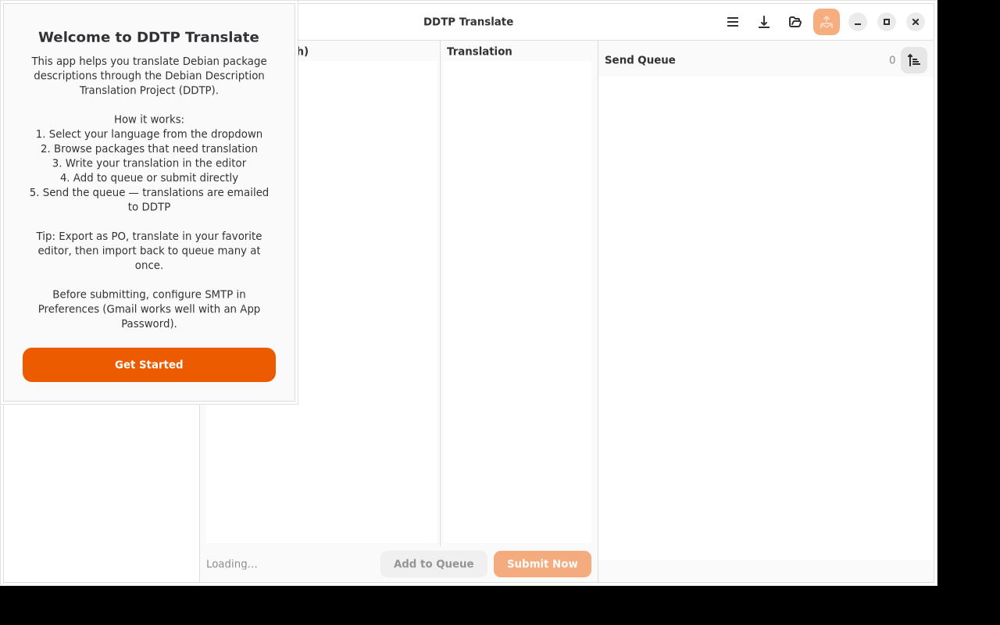

# DDTP Translate

[](https://github.com/yeager/ddtp-translate/releases)
[](LICENSE)
[](https://app.transifex.com/danielnylander/ddtp-translate/)

A GTK4/Adwaita application for translating Debian package descriptions via the Debian Description Translation Project (DDTP).



## Features

- **3-pane layout** — Package list, side-by-side editor, and send queue
- **Translation queue** — Queue translations and batch-send with rate limiting
- **PO export/import** — Export untranslated packages as .po, translate in your editor, import back
- **Batch send with progress** — Per-package status, countdown timer, cancel support
- **Welcome dialog** — Explains DDTP workflow on first start
- **Rate limiting** — Configurable delay (default 30s) between emails to protect the server
- **38 languages** — All DDTP-supported languages available
- **Progress bar** — Pulse animation while loading package data
- **Sortable packages** — A-Z / Z-A sorting
- **Search & filter** — Find packages quickly
- **Mirror fallback** — When ddtp.debian.org is down, compares Translation files from deb.debian.org
- **Gmail preset** — One-click SMTP setup for Gmail
- **Internationalized** — Swedish 100% translated, 18 languages via Transifex

## Screenshot

The 3-pane interface shows the package list (left), translation editor (center), and send queue (right). The welcome dialog explains the workflow on first launch.

## Installation

### Debian/Ubuntu

```bash
curl -fsSL https://yeager.github.io/debian-repo/KEY.gpg | sudo gpg --dearmor -o /usr/share/keyrings/yeager-archive-keyring.gpg
echo "deb [signed-by=/usr/share/keyrings/yeager-archive-keyring.gpg] https://yeager.github.io/debian-repo stable main" | sudo tee /etc/apt/sources.list.d/yeager.list
sudo apt update
sudo apt install ddtp-translate
```

### Fedora/RHEL

```bash
sudo dnf config-manager --add-repo https://yeager.github.io/rpm-repo/yeager.repo
sudo dnf install ddtp-translate
```

### From source

```bash
pip install .
ddtp-translate
```

## Man page

```bash
man ddtp-translate
```

## 🌍 Contributing Translations

Help translate DDTP Translate into your language on Transifex!

**[→ Translate on Transifex](https://app.transifex.com/danielnylander/ddtp-translate/)**

Currently 18 languages. Swedish 100% translated.

### For Translators
1. Create a free account at [Transifex](https://www.transifex.com)
2. Join the [danielnylander](https://app.transifex.com/danielnylander/) organization
3. Start translating!

Translations are automatically synced via GitHub Actions.

## License

GPL-3.0-or-later — Daniel Nylander <daniel@danielnylander.se>
