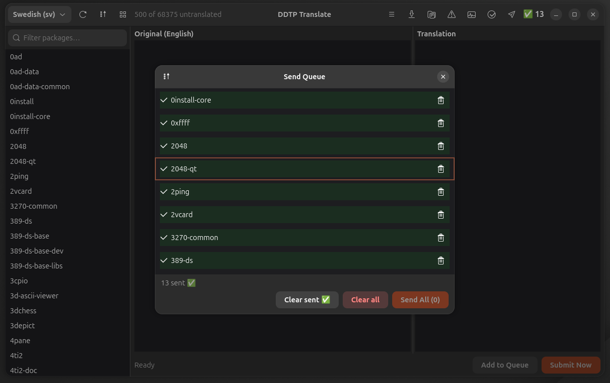
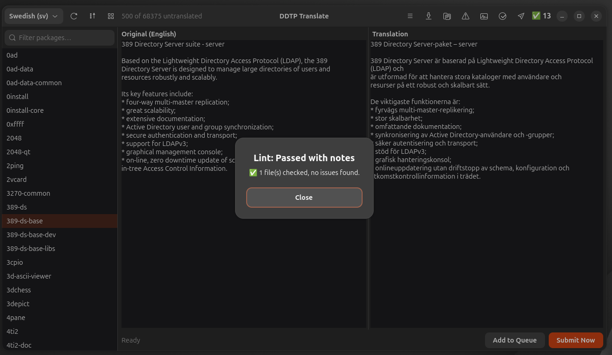
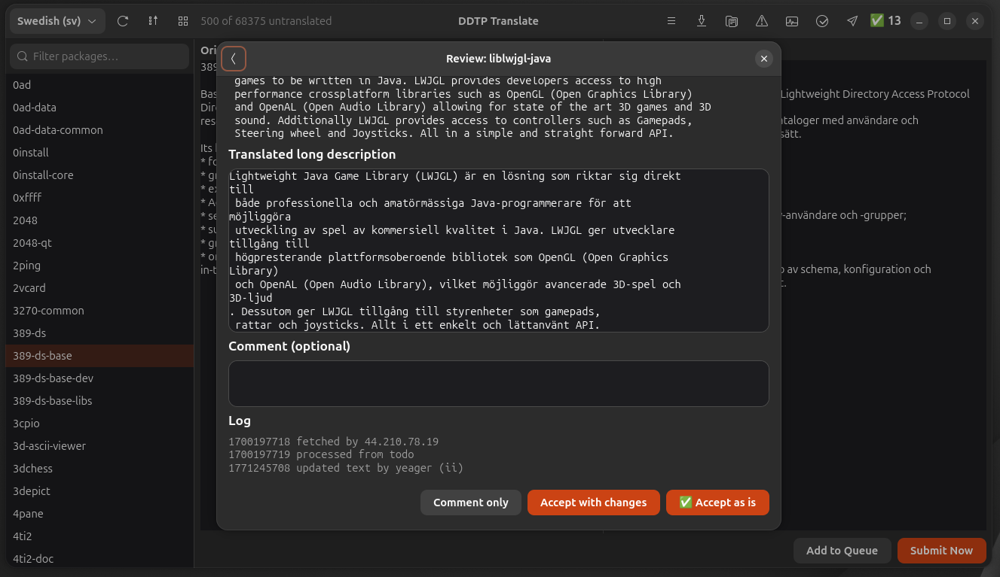

# DDTP Translate

[](https://github.com/yeager/ddtp-translate/releases)
[](LICENSE)
[](https://app.transifex.com/danielnylander/ddtp-translate/)

A GTK4/Adwaita application for translating Debian package descriptions via the Debian Description Translation Project (DDTP).

## Features

- **3-pane layout** — Package list, side-by-side editor, and send queue
- **DDTSS integration** — Submit translations directly via the DDTSS web interface (no email needed)
- **Translation queue** — Queue translations and batch-submit instantly
- **Review translations** — Browse, review, accept/reject pending translations from DDTSS
- **Lint checking** — Validate translations with l10n-lint integration
- **PO export/import** — Export untranslated packages as .po, translate in your editor, import back
- **Batch submit with progress** — Per-package status, cancel support
- **38 languages** — All DDTP-supported languages available
- **Search & filter** — Find packages quickly
- **Mirror fallback** — When ddtp.debian.org is down, compares Translation files from deb.debian.org
- **Internationalized** — Swedish 100% translated, 18 languages via Transifex

## Screenshots

### Send Queue
Queue translations and batch-submit. Sent packages are marked with ✅ and won't be re-submitted.



### Lint Check
Validate translations with l10n-lint before submitting.



### Review Translations
Browse pending reviews, accept as-is, accept with changes, or leave comments.



## Installation

### Debian/Ubuntu

```bash
curl -fsSL https://yeager.github.io/debian-repo/KEY.gpg | sudo gpg --dearmor -o /usr/share/keyrings/yeager-archive-keyring.gpg
echo "deb [signed-by=/usr/share/keyrings/yeager-archive-keyring.gpg] https://yeager.github.io/debian-repo stable main" | sudo tee /etc/apt/sources.list.d/yeager.list
sudo apt update
sudo apt install ddtp-translate
```

### From source

```bash
pip install .
ddtp-translate
```

## Man page

```bash
man ddtp-translate
```

## 🌍 Contributing Translations

Help translate DDTP Translate into your language on Transifex!

**[→ Translate on Transifex](https://app.transifex.com/danielnylander/ddtp-translate/)**

Currently 18 languages. Swedish 100% translated.

### For Translators
1. Create a free account at [Transifex](https://www.transifex.com)
2. Join the [danielnylander](https://app.transifex.com/danielnylander/) organization
3. Start translating!

Translations are automatically synced via GitHub Actions.

## License

GPL-3.0-or-later — Daniel Nylander <daniel@danielnylander.se>
