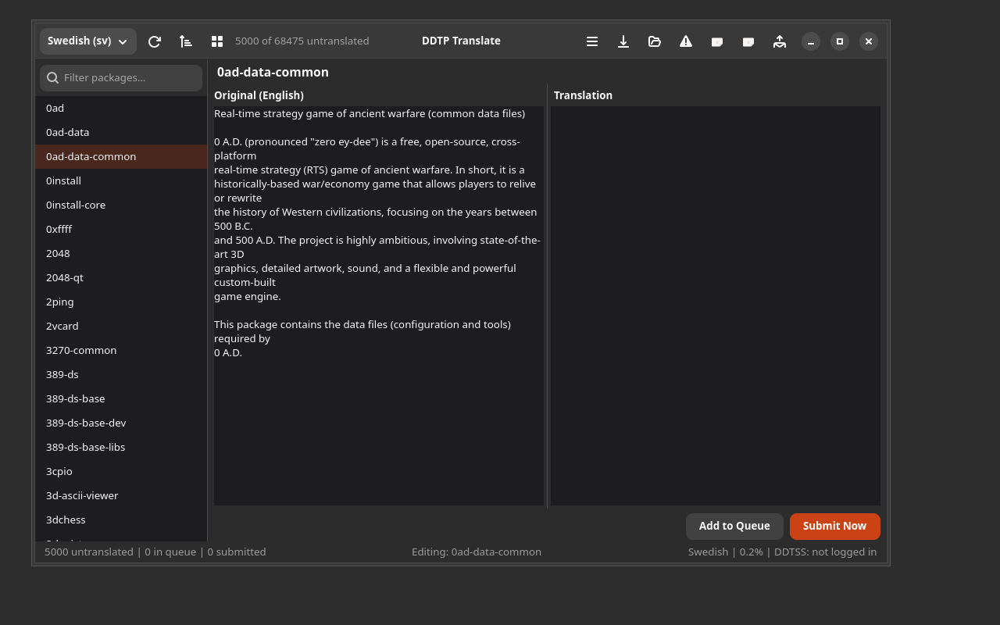

# DDTP Translate

[](https://github.com/yeager/ddtp-translate/releases)
[](LICENSE)
[](https://app.transifex.com/danielnylander/ddtp-translate/)

A GTK4/Adwaita application for translating Debian package descriptions via the Debian Description Translation Project (DDTP).



## Features

### Translation Workflow
- **Three-panel layout** — Package list, side-by-side original + translation editor
- **DDTSS integration** — Submit translations directly via the DDTSS web interface (recommended)
- **SMTP fallback** — Legacy email submission to pdesc@ddtp.debian.org
- **Translation queue** — Queue translations and batch-submit with progress tracking
- **Auto-advance** — Automatically moves to next package after submit

### Review & Quality
- **Review translations** — Browse, review, accept/reject pending translations from DDTSS
- **Batch review** — Accept all pending reviews at once
- **Lint checking** — Validate translations with l10n-lint before submitting
- **Auto-lint** — Optional automatic lint check before every submission

### Import & Export
- **PO export with filters** — Export untranslated packages filtered by count, starting letter, or regex
- **PO import with review** — Import .po files, auto-lint each entry, review before queueing
- **Batch submit** — Send entire queue with per-package progress and cancel support

### Interface
- **Permanent status bar** — Package counts, queue status, language completion %, DDTSS login state
- **Keyboard shortcuts** — Ctrl+Enter (submit), Ctrl+Shift+Enter (queue), Ctrl+N/P (navigate), Ctrl+L (lint), F5 (refresh)
- **Heatmap view** — Visual overview of translation coverage
- **Search & filter** — Find packages quickly
- **Statistics** — DDTP translation statistics per language
- **38 languages** — All DDTP-supported languages available
- **Mirror fallback** — When ddtp.debian.org is down, compares Translation files from deb.debian.org

## Screenshots

### Three-Panel Editor
Side-by-side original and translation with package list sidebar.


### PO Export Filter
Filter packages before export by count, starting letter, or regex.


### Import Review
Review imported translations with automatic lint checking.


### Review Translations
Browse pending reviews, accept as-is, accept with changes, or leave comments.


### Keyboard Shortcuts
Full keyboard shortcut reference accessible from the menu.


## Installation

### Debian/Ubuntu

```bash
# DEB822 format (Ubuntu 24.04+ / Debian 12+)
sudo tee /etc/apt/sources.list.d/yeager.sources << 'EOF'
Types: deb
URIs: https://yeager.github.io/debian-repo
Suites: stable
Components: main
Signed-By: /usr/share/keyrings/yeager-archive-keyring.gpg
EOF

curl -fsSL https://yeager.github.io/debian-repo/KEY.gpg | sudo gpg --dearmor -o /usr/share/keyrings/yeager-archive-keyring.gpg
sudo apt update
sudo apt install ddtp-translate
```

### Fedora/RPM

```bash
sudo dnf config-manager --add-repo https://yeager.github.io/rpm-repo/yeager.repo
sudo dnf install ddtp-translate
```

### From source

```bash
pip install .
ddtp-translate
```

## Keyboard Shortcuts

| Shortcut | Action |
|----------|--------|
| Ctrl+Enter | Submit translation |
| Ctrl+Shift+Enter | Add to queue |
| Ctrl+N | Next package |
| Ctrl+P | Previous package |
| Ctrl+L | Lint translation |
| Ctrl+F | Search packages |
| F5 | Refresh package list |
| Ctrl+Q | Quit |

## DDTSS Setup

1. Create an account at https://ddtp.debian.org/ddtss/index.cgi/createlogin
2. Open Preferences → DDTSS tab
3. Enter your alias and password
4. Click "Test Login" to verify
5. Set "Submit via" to "DDTSS (web)"

See [DDTSS.md](DDTSS.md) for detailed documentation.

## 🌍 Contributing Translations

Help translate DDTP Translate into your language on Transifex!

**[→ Translate on Transifex](https://app.transifex.com/danielnylander/ddtp-translate/)**

Currently 18 languages. Swedish 100% translated.

## License

GPL-3.0-or-later — Daniel Nylander <daniel@danielnylander.se>
