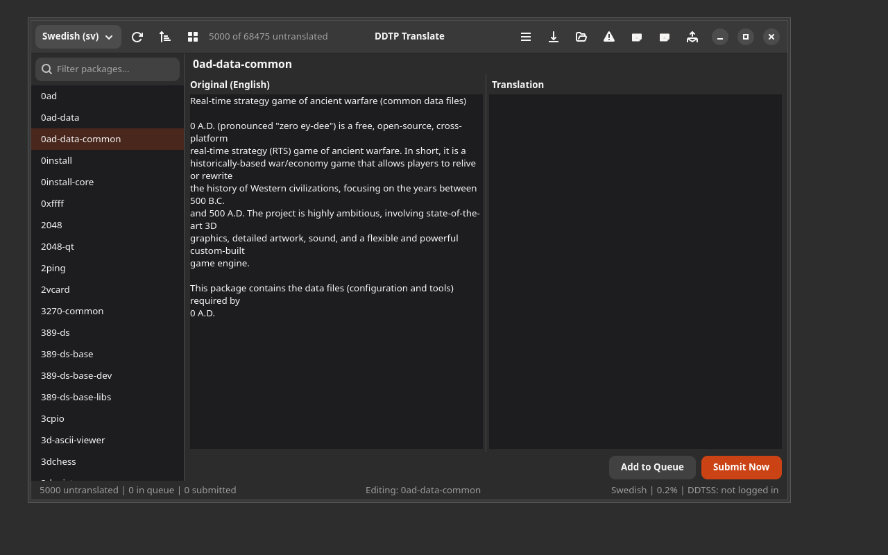

# DDTP Translate [](https://github.com/yeager/ddtp-translate)

## Screenshot



## Description

DDTP Translate is a GTK4/Adwaita application for translating Debian package descriptions via the DDTP (Debian Description Translation Project). The application provides an intuitive interface for translators to contribute to Debian package description translations, helping make Debian more accessible to users worldwide.

The application streamlines the translation workflow by providing easy access to untranslated descriptions, translation memory features, and quality assurance tools for reviewing existing translations.

## Features

- Translate Debian package descriptions
- Browse untranslated and pending descriptions
- Review and edit existing translations
- Translation memory and suggestions
- Quality assurance tools
- Modern GTK4/Adwaita interface
- Offline translation capabilities
- Batch translation support

## Installation

### APT Repository (Debian/Ubuntu)

```bash
echo "deb https://yeager.github.io/debian-repo stable main" | sudo tee /etc/apt/sources.list.d/yeager-l10n.list
sudo apt update
sudo apt install ddtp-translate
```

### Building from Source

```bash
git clone https://github.com/yeager/ddtp-translate.git
cd ddtp-translate
pip install -e .
```

## Translation

This application is managed on Transifex: https://app.transifex.com/danielnylander/ddtp-translate/

Available in 11 languages: Swedish, German, French, Spanish, Italian, Portuguese, Dutch, Polish, Czech, Russian, and Chinese (Simplified).

## License

GPL-3.0-or-later

## Author

Daniel Nylander (daniel@danielnylander.se)